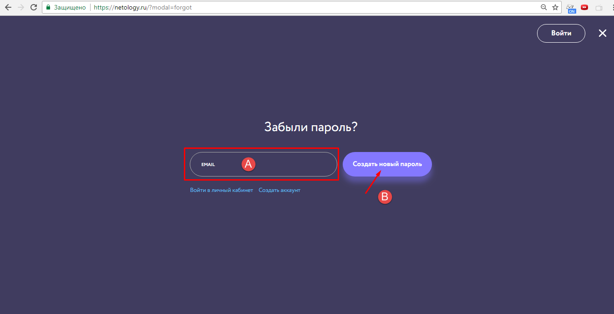
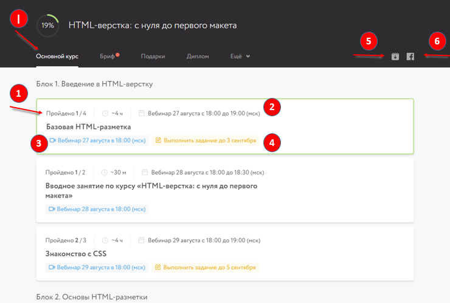
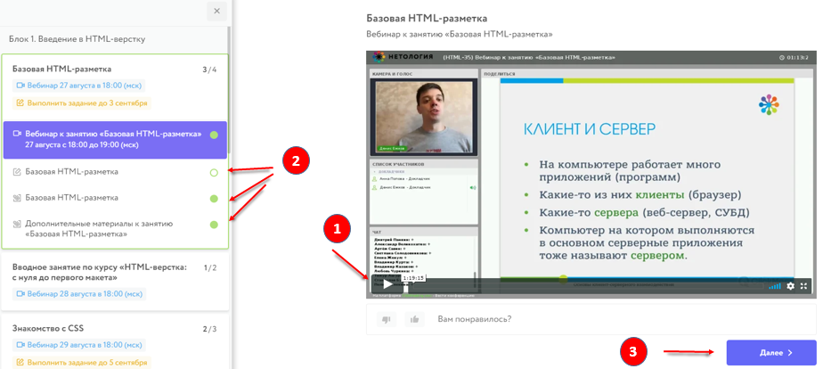
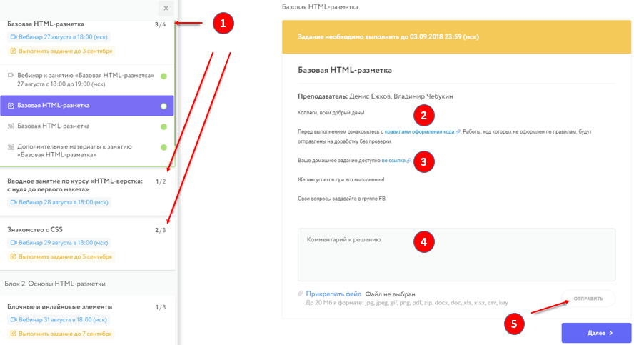
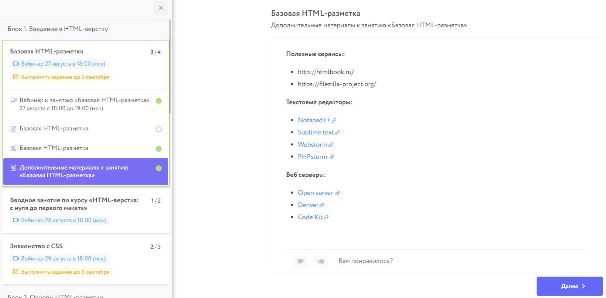
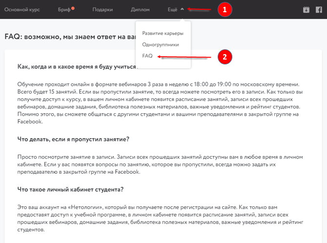

# Инструкция по работе с личным кабинетом

## Вход в личный кабинет 
1. Зайдите на сайт [www.netology.ru](https://netology.ru)
2. В правом верхнем углу нажмите кнопку **ВОЙТИ**

3. Открывается окно **ВОЙТИ В АККАУНТ НЕТОЛОГИИ**. В соответствующие поля введите электронную почту (A) и пароль (B) и нажмите кнопку **ВОЙТИ (C)**.

4. Если вы забыли пароль, нажмите на кнопку **ЗАБЫЛИ ПАРОЛЬ**. В открывшемся окне введите свою электронную почту (A) и нажмите кнопку **СОЗДАТЬ НОВЫЙ ПАРОЛЬ (B)**.

5. Для регистрации нажмите кнопку **СОЗДАТЬ АККАУНТ**. Выберите направление (A), введите ваше имя (B) и адрес электронной почты (C), поставьте галочку о том, что вы принимаете [пользовательское соглашение](https://netology.ru/legal) (D) и нажмите кнопку **ЗАРЕГИСТРИРОВАТЬСЯ (E)**.

## Навигация по личному кабинету
1. Зайдя на сайт с вашим логином и паролем, в правом верхнем углу нажмите иконку личного кабинета (A). В меню этой иконки выбираете [Мой профиль и программы](https://netology.ru/profile) **(B).** И попадаете в личный кабинет.

2. В личном кабинете вы можете видеть ваши программы обучения, профессии и видеокурсы.

3. Выбираете интересующий курс, например, «HTML-вёрстка: с нуля до первого макета».

## **ОСНОВНОЙ КУРС (I)**
Список занятий в этом курсе. По каждому занятию есть информация о количестве подзадач и сколько из них пройдено (1), примерное время продолжительности вебинара (2), дата и время начала вебинара (3), ссылка на трансляцию* или запись пройденного вебинара (4).

 *После лекции через некоторое время (примерно через 2 часа после её окончания) будет доступна видеозапись.

На некоторых курсах нужно пройти промежуточные тесты.* По ссылке **ВЫПОЛНИТЬ ЗАДАНИЕ (5)** вы попадаете на вкладку домашних заданий. 

При желании можно получить файл ics с расписанием всех занятий курса (6), чтобы добавить его в Google Calendar, MS Outlook или любое другое приложение-календарь поддерживающее формат ics.
Если вы еще не состоите закрытой группе курса в Facebook, можно присоединиться кликнув на иконку (7).

Доступ к самой вкладке урока открывается за два часа до начала вебинара.

## **ВЕБИНАР К ЗАНЯТИЮ**
В этой вкладке содержится информация о подключении к уроку или запись урока, которую можно просмотреть в удобное время (1)

Перейти к задачам (2) можно кликнув на задачу или по кнопке "далее" (3)

## **ВЫПОЛНЕНИЕ ЗАДАНИЙ**
В этой вкладке проходит ваше общение с преподавателем, проверяющим домашнее задание. У каждого урока есть несколько задач (1) Самая главная, это домашнее задание, которое необходимо сдавать на проверку в поле комментарий (4). Вы будете отправлять ссылки на выполненное домашнее задание в Codepen. Здесь же будет отображаться ответ и комментарий преподавателя.

Перед выполнением заданий, нужно ознакомиться с [правилами оформления кода](https://netology-university.bitbucket.io/codestyle/index.html) (2) для HTML и CSS и [инструкцией по работе с онлайн-редактором Codepen](https://netology-university.bitbucket.io/guides/wm/codepen-guide/). Описание задания доступно **по ссылке** (3). После выполнения задания в Codepen необходимо сохранить результат, скопировать адрес из адресной строки браузера и вставить скопированную ссылку в поле «Комментарий к решению» (4). При необходимости, можно дополнить ссылку на решение своими комментариями или вопросами. Порядок выполнения и публикации решения подробно описан в первом задании. После добавления текста в поле комментарий станет доступна кнопка «Отправить» (5). Нажав на нее, вы отправите решение на проверку. Задание при этом примет соответствующий статус.

Задания, по которым истек срок выполнения, перемещаются в группу “Не выполнены”. Открыть к ним доступ можно лишь **три раза** за курс. Чтобы получить доступ, нужно сначала выполнить задание и только после этого заполнить
[форму](https://docs.google.com/forms/d/e/1FAIpQLSewC8Fv3NQacd24-NXbEtQNokW2akbekmnUWMavPY9winPESQ/viewform). Пожалуйста, не откладывайте выполнение заданий на потом, делайте их сразу после появления.

## **ДОПОЛНИТЕЛЬНЫЕ МАТЕРИАЛЫ**
В первой вкладке с дополнительными материалами будет лежать презентация, которой преподаватель пользовался на уроке.

Если имеется вторая вкладка с дополнительными материалами, в ней вы найдете полезную информацию, ресурсы и рекомендуемые преподавателем ссылки для закрепления материала или для приобретения экстра знаний.

## **БРИФ**
Чтобы обучение в «Нетологии» было для Вас максимально эффективным, мы просим

Вас ответить на некоторые вопросы.

## **FAQ И СВЯЗЬ С КООРДИНАТОРОМ**
Список самых популярных вопросов по курсу с ответами. Пожалуйста, ознакомьтесь с ним перед началом курса.
Для этого нажмите на ссылку "Еще" (1) и перейдите на "FAQ" (2).

Если вы не нашли ответ на свой вопрос, вы можете связаться с координатором курса прямо из личного кабинета. Для этого нажмите на значок конверта (1) пролистайте до конца станицы и нажмите на "У меня остались вопросы" (2).
Кроме того, обязательно вступайте в закрытую группу Facebook, где можно увидеть анонсы лекций, задать вопросы кураторам и аспирантам по вашему курсу (3).

